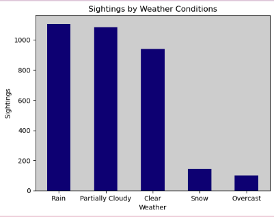

# Bigfoot Sightings Data Analysis

## Project Overview

In this analysis, we examine Bigfoot sightings data from the Bigfoot Field Researchers Organization (BFRO) to uncover trends and patterns in reported sightings. The goal of this project is to explore how geographic, temporal, and environmental factors influence Bigfoot sightings using various data analysis techniques.

### Key Questions Answered:
- **What environmental or situational factors are associated with Bigfoot sightings?**
- **Are certain regions more prone to these reports?**

## Data Description
The dataset used in this project includes Bigfoot sighting reports, categorized by location, time, and environmental conditions such as weather. The data was cleaned and processed to create meaningful insights through visualization and statistical analysis.

Files used in this project:
- **bfro_locations.csv**: The dataset containing the locations of Bigfoot sightings.
- **bfro_reports.json**: Raw JSON data with details of individual sightings.
- **bfro_reports_geocoded.csv**: Geocoded data for the sightings.
- **finalNotebook.ipynb**: The Jupyter notebook containing the analysis and visualizations.
- **timothyrenner-bfro-sightings-data**: The dataset used for the sightings analysis.

## Methodology

The project applies a variety of exploratory data analysis (EDA) and statistical techniques to uncover patterns within the dataset. Specific techniques and methodologies employed include:

- **Data Cleaning & Transformation**: Preprocessing missing values, categorizing data points, and creating new variables for deeper insights.
- **Geospatial Analysis**: Leveraging geospatial tools to examine the geographic distribution of sightings across different regions of the U.S. and Canada.
- **Time Series Analysis**: Analyzing the trends in sighting frequency over the years and months to identify significant seasonal variations.
- **Weather Impact Analysis**: Evaluating the relationship between weather conditions (rain, snow, overcast) and sighting frequency, including hypothesis testing to measure statistical significance.

## Team Members

- **Kat Chu**: Geographic analysis, state-region classification, data preprocessing, readme, slideshow
- **Quinn Daley**: Yearly and report-type analysis, trend visualization
- **Mackenzie Deets**: Temporal analysis, seasonal distribution of sightings
- **Oumar Diakite**: Map visualization of geographic sightings, data summary
- **Jacob Woolley**: Weather condition analysis, regression modeling

## Analysis & Results

### 1. Geographic Distribution of Sightings
In this section, we explored the distribution of sightings across various regions of the United States. By classifying states into four regions (West, Midwest, South, Northeast), we identified areas where sightings were most common. The West and South regions stood out as hotspots for Bigfoot activity, while the Northeast showed fewer reported sightings.

### 2. Trends in Sightings Over Time
This analysis looked at the trends in Bigfoot sightings over the years. By examining the number of sightings per year, we explored shifts in reporting frequency and the impact of different report types on sighting trends.

### 3. Seasonal and Monthly Sightings Distribution
Through this analysis, we discovered that the number of Bigfoot sightings peaks during the summer months, with a secondary peak in the fall. This trend is likely influenced by increased outdoor activities during the warmer months, such as hiking and hunting.

### 4. Weather Conditions Impact on Sightings
We examined whether weather conditions, such as rain or snow, had any effect on the frequency of sightings. Our results indicated that rain was the most common weather condition during sightings, while overcast weather was the least common. 

Additionally, a linear regression analysis on cloud cover vs. visibility showed no significant impact on the likelihood of a sighting.

### 5. Geospatial Visualization of Sightings
We created a geospatial map visualization to show the geographic spread of Bigfoot sightings in the U.S. and Canada. Using latitude and longitude coordinates, we visualized the data points based on sighting classifications (Class A, Class B, and Class C).

## Conclusion

This project provides valuable insights into the geographic and temporal patterns of Bigfoot sightings across the United States and Canada. Our analysis uncovered hotspots of activity, seasonal trends, and weather-related factors that may influence the frequency of sightings. The project also highlights the importance of data cleaning and transformation techniques in ensuring reliable and meaningful analysis outcomes.

## Future Work

- **Deep Learning**: We could explore using machine learning models to predict Bigfoot sightings based on various features such as location, weather, and seasonal patterns.
- **Expansion**: Analyzing Bigfoot sightings in other regions of the world, particularly where Bigfoot-like creatures are reported (e.g., Yeti in the Himalayas).

  
## Credits

This project was completed by the following team members:

- Kat Chu
- Quinn Daley
- Mackenzie Deets
- Oumar Diakite
- Jacob Woolley

Special thanks to our course instructors and the Bigfoot Field Researchers Organization (BFRO) for providing the dataset.

## License

This project is licensed under the MIT License - see the [LICENSE](LICENSE) file for details.
